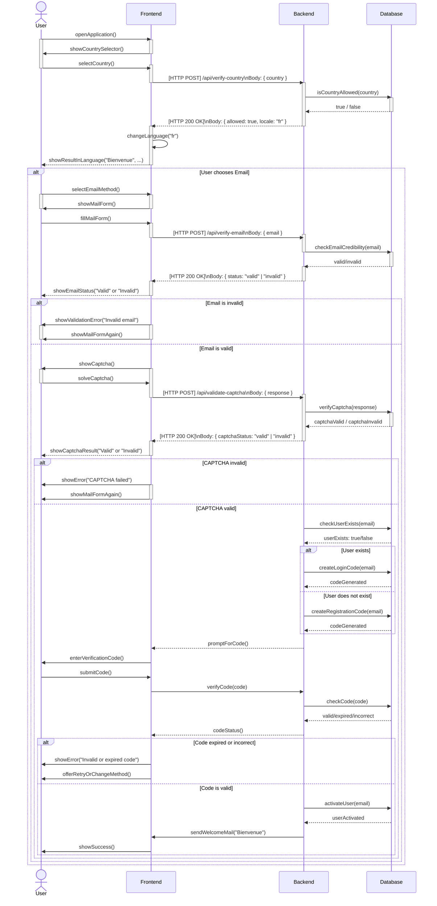

```mermaid

sequenceDiagram
  actor User
  participant Frontend
  participant Backend
  participant Database

  %% Application Launch
  User->>Frontend: openApplication()
  activate User
  activate Frontend
  Frontend->>User: showCountrySelector()

  deactivate Frontend

  %% Country Selection
  User->>Frontend: selectCountry()
  activate Frontend
  deactivate User

  %% Send API Request to Backend
  Frontend->>Backend: [HTTP POST] /api/verify-country\nBody: { country }
  deactivate Frontend
  activate Backend

  %% Query the Database
  Backend->>Database: isCountryAllowed(country)
  activate Database
  Database-->>Backend: true / false
  deactivate Database

  %% Backend Response
  Backend-->>Frontend: [HTTP 200 OK]\nBody: { allowed: true, locale: "fr" }
  deactivate Backend

  %% Frontend Handling
  activate Frontend
  Frontend->>Frontend: changeLanguage("fr")
  Frontend-->>User: showResultInLanguage("Bienvenue", ...)
  deactivate Frontend


    alt User chooses Email
    %% Email method selection
        User->>Frontend: selectEmailMethod()
        activate User
        activate Frontend
        Frontend->>User: showMailForm()
        deactivate User
        deactivate Frontend

     %% Filling and submitting email form
        User->>Frontend: fillMailForm()
        activate Frontend

    %% Send request to backend
        Frontend->>Backend: [HTTP POST] /api/verify-email\nBody: { email }
        activate Backend
        deactivate Frontend

    %% Query database for email credibility
         Backend->>Database: checkEmailCredibility(email)
        deactivate Backend
        activate Database

        Database-->>Backend: valid/invalid
        deactivate Database
        activate Backend

    %% Return result to frontend
        Backend-->>Frontend: [HTTP 200 OK]\nBody: { status: "valid" | "invalid" }
  deactivate Backend

 %% Show result to user
      activate Frontend
      Frontend-->>User: showEmailStatus("Valid" or "Invalid")
      deactivate Frontend

        alt Email is invalid

            Frontend->>User: showValidationError("Invalid email")
            activate Frontend
            activate User

            Frontend->>User: showMailFormAgain()
            deactivate Frontend
            deactivate User

        else Email is valid

%% Show captcha form
            Frontend->>User: showCaptcha()
            activate Frontend
            activate User

%% User solves captcha
            User->>Frontend: solveCaptcha()
            deactivate User

            %% Send captcha response to backend
            Frontend->>Backend: [HTTP POST] /api/validate-captcha\nBody: { response }
            activate Backend
            deactivate Frontend

            %% Backend validates captcha via DB or service
            Backend->>Database: verifyCaptcha(response)
            activate Database
            Database-->>Backend: captchaValid / captchaInvalid
            deactivate Database


            %% Return captcha validation status to frontend
            Backend-->>Frontend: [HTTP 200 OK]\nBody: { captchaStatus: "valid" | "invalid" }
            deactivate Backend
            activate Frontend
             Frontend-->>User: showCaptchaResult("Valid" or "Invalid")
             deactivate Frontend


            alt CAPTCHA invalid

                Frontend->>User: showError("CAPTCHA failed")
                activate Frontend
                Frontend->>User: showMailFormAgain()
                deactivate Frontend

            else CAPTCHA valid
                Backend->>Database: checkUserExists(email)
                Database-->>Backend: userExists: true/false

                alt User exists
                    Backend->>Database: createLoginCode(email)
                    Database-->>Backend: codeGenerated
                else User does not exist
                    Backend->>Database: createRegistrationCode(email)
                    Database-->>Backend: codeGenerated
                end

                Backend-->>Frontend: promptForCode()
                Frontend->>User: enterVerificationCode()
                User->>Frontend: submitCode()
                Frontend->>Backend: verifyCode(code)
                Backend->>Database: checkCode(code)
                Database-->>Backend: valid/expired/incorrect
                Backend-->>Frontend: codeStatus()

                alt Code expired or incorrect
                    Frontend->>User: showError("Invalid or expired code")
                    Frontend->>User: offerRetryOrChangeMethod()
                else Code is valid
                    Backend->>Database: activateUser(email)
                    Database-->>Backend: userActivated
                    Backend->>Frontend: sendWelcomeMail("Bienvenue")
                    Frontend->>User: showSuccess()
                end
            end
        end

end

```
