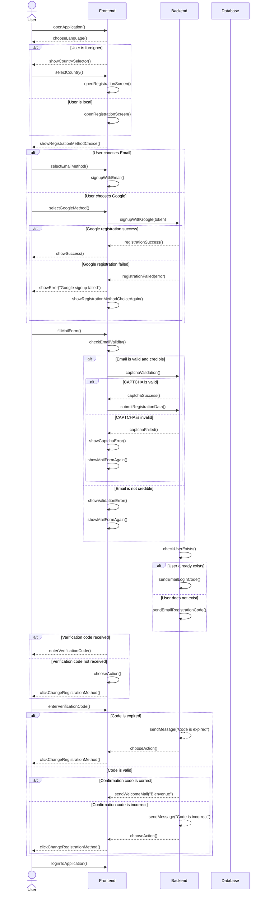

```mermaid
sequenceDiagram

actor User
participant Frontend
participant Backend
participant Database

User->>Frontend: openApplication()
Frontend-->>User: chooseLanguage()

alt User is foreigner
    Frontend-->>User: showCountrySelector()
    User->>Frontend: selectCountry()
    Frontend->>Frontend: openRegistrationScreen()
else User is local
    Frontend->>Frontend: openRegistrationScreen()
end

Frontend-->>User: showRegistrationMethodChoice()

alt User chooses Email
    User->>Frontend: selectEmailMethod()
    Frontend->>Frontend: signupWithEmail()
else User chooses Google
    User->>Frontend: selectGoogleMethod()
    Frontend->>Backend: signupWithGoogle(token)

    alt Google registration success
        Backend-->>Frontend: registrationSuccess()
        Frontend-->>User: showSuccess()
    else Google registration failed
        Backend-->>Frontend: registrationFailed(error)
        Frontend-->>User: showError("Google signup failed")
        Frontend->>Frontend: showRegistrationMethodChoiceAgain()
    end
end

User->>Frontend: fillMailForm()
Frontend->>Frontend: checkEmailValidity()

alt Email is valid and credible
    Frontend->>Backend: captchaValidation()

    alt CAPTCHA is valid
        Backend-->>Frontend: captchaSuccess()
        Frontend->>Backend: submitRegistrationData()
    else CAPTCHA is invalid
        Backend-->>Frontend: captchaFailed()
        Frontend->>Frontend: showCaptchaError()
        Frontend->>Frontend: showMailFormAgain()
    end
else Email is not credible
    Frontend->>Frontend: showValidationError()
    Frontend->>Frontend: showMailFormAgain()
end

Backend->>Backend: checkUserExists()

alt User already exists
    Backend->>Backend: sendEmailLoginCode()
else User does not exist
    Backend->>Backend: sendEmailRegistrationCode()
end

alt Verification code received
    Frontend-->>User: enterVerificationCode()
else Verification code not received
    Frontend->>Frontend: chooseAction()
    Frontend-->>User: clickChangeRegistrationMethod()
end

User->>Frontend: enterVerificationCode()

alt Code is expired
    Backend-->>Backend: sendMessage("Code is expired")
    Backend-->>Frontend: chooseAction()
    Frontend-->>User: clickChangeRegistrationMethod()
else Code is valid
    alt Confirmation code is correct
        Backend-->>Frontend: sendWelcomeMail("Bienvenue")
    else Confirmation code is incorrect
        Backend-->>Backend: sendMessage("Code is incorrect")
        Backend-->>Frontend: chooseAction()
        Frontend-->>User: clickChangeRegistrationMethod()
    end
end

User->>Frontend: loginToApplication()
```
