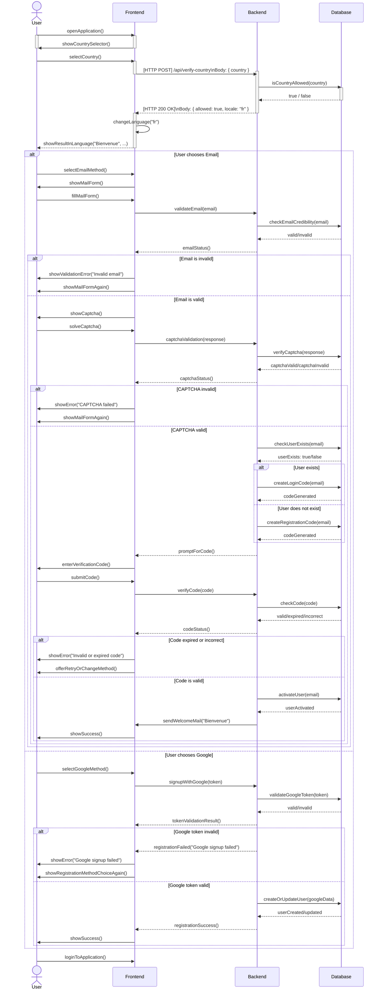

```mermaid
sequenceDiagram
    actor User
    participant Frontend
    participant Backend
    participant Database

    User->>Frontend: openApplication()
    activate User
    activate Frontend
    Frontend->>User: showCountrySelector()
    deactivate User
    deactivate Frontend

    User->>Frontend: selectCountry()
    activate Frontend

    Frontend->>Backend: [HTTP POST] /api/verify-country\nBody: { country }
    activate Backend
    deactivate Frontend

    Backend->>Database: isCountryAllowed(country)
    activate Database
    Database-->>Backend: true / false
    deactivate Database

    Backend-->>Frontend: [HTTP 200 OK]\nBody: { allowed: true, locale: "fr" }
    deactivate Backend

    activate Frontend
    Frontend->>Frontend: changeLanguage("fr")
    Frontend-->>User: showResultInLanguage("Bienvenue", ...)
    deactivate Frontend


    alt User chooses Email
        User->>Frontend: selectEmailMethod()

        Frontend->>User: showMailForm()
        User->>Frontend: fillMailForm()
        Frontend->>Backend: validateEmail(email)
        Backend->>Database: checkEmailCredibility(email)
        Database-->>Backend: valid/invalid
        Backend-->>Frontend: emailStatus()

        alt Email is invalid
            Frontend->>User: showValidationError("Invalid email")
            Frontend->>User: showMailFormAgain()
        else Email is valid
            Frontend->>User: showCaptcha()
            User->>Frontend: solveCaptcha()
            Frontend->>Backend: captchaValidation(response)
            Backend->>Database: verifyCaptcha(response)
            Database-->>Backend: captchaValid/captchaInvalid
            Backend-->>Frontend: captchaStatus()

            alt CAPTCHA invalid
                Frontend->>User: showError("CAPTCHA failed")
                Frontend->>User: showMailFormAgain()
            else CAPTCHA valid
                Backend->>Database: checkUserExists(email)
                Database-->>Backend: userExists: true/false

                alt User exists
                    Backend->>Database: createLoginCode(email)
                    Database-->>Backend: codeGenerated
                else User does not exist
                    Backend->>Database: createRegistrationCode(email)
                    Database-->>Backend: codeGenerated
                end

                Backend-->>Frontend: promptForCode()
                Frontend->>User: enterVerificationCode()
                User->>Frontend: submitCode()
                Frontend->>Backend: verifyCode(code)
                Backend->>Database: checkCode(code)
                Database-->>Backend: valid/expired/incorrect
                Backend-->>Frontend: codeStatus()

                alt Code expired or incorrect
                    Frontend->>User: showError("Invalid or expired code")
                    Frontend->>User: offerRetryOrChangeMethod()
                else Code is valid
                    Backend->>Database: activateUser(email)
                    Database-->>Backend: userActivated
                    Backend->>Frontend: sendWelcomeMail("Bienvenue")
                    Frontend->>User: showSuccess()
                end
            end
        end

    else User chooses Google
        User->>Frontend: selectGoogleMethod()
        Frontend->>Backend: signupWithGoogle(token)
        Backend->>Database: validateGoogleToken(token)
        Database-->>Backend: valid/invalid
        Backend-->>Frontend: tokenValidationResult()

        alt Google token invalid
            Backend-->>Frontend: registrationFailed("Google signup failed")
            Frontend->>User: showError("Google signup failed")
            Frontend->>User: showRegistrationMethodChoiceAgain()
        else Google token valid
            Backend->>Database: createOrUpdateUser(googleData)
            Database-->>Backend: userCreated/updated
            Backend-->>Frontend: registrationSuccess()
            Frontend->>User: showSuccess()
        end
    end

    User->>Frontend: loginToApplication()

```
