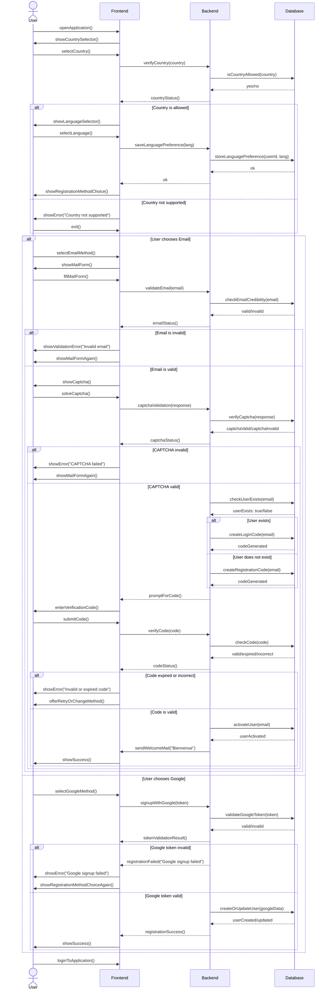

```mermaid
sequenceDiagram
    actor User
    participant Frontend
    participant Backend
    participant Database

    User->>Frontend: openApplication()
    Frontend->>User: showCountrySelector()
    User->>Frontend: selectCountry()
    Frontend->>Backend: verifyCountry(country)
    Backend->>Database: isCountryAllowed(country)
    Database-->>Backend: yes/no
    Backend-->>Frontend: countryStatus()

    alt Country is allowed
        Frontend->>User: showLanguageSelector()
        User->>Frontend: selectLanguage()
        Frontend->>Backend: saveLanguagePreference(lang)
        Backend->>Database: storeLanguagePreference(userId, lang)
        Database-->>Backend: ok
        Backend-->>Frontend: ok
        Frontend->>User: showRegistrationMethodChoice()
    else Country not supported
        Frontend->>User: showError("Country not supported")
        User->>Frontend: exit()
    end

    alt User chooses Email
        User->>Frontend: selectEmailMethod()
        Frontend->>User: showMailForm()
        User->>Frontend: fillMailForm()
        Frontend->>Backend: validateEmail(email)
        Backend->>Database: checkEmailCredibility(email)
        Database-->>Backend: valid/invalid
        Backend-->>Frontend: emailStatus()

        alt Email is invalid
            Frontend->>User: showValidationError("Invalid email")
            Frontend->>User: showMailFormAgain()
        else Email is valid
            Frontend->>User: showCaptcha()
            User->>Frontend: solveCaptcha()
            Frontend->>Backend: captchaValidation(response)
            Backend->>Database: verifyCaptcha(response)
            Database-->>Backend: captchaValid/captchaInvalid
            Backend-->>Frontend: captchaStatus()

            alt CAPTCHA invalid
                Frontend->>User: showError("CAPTCHA failed")
                Frontend->>User: showMailFormAgain()
            else CAPTCHA valid
                Backend->>Database: checkUserExists(email)
                Database-->>Backend: userExists: true/false

                alt User exists
                    Backend->>Database: createLoginCode(email)
                    Database-->>Backend: codeGenerated
                else User does not exist
                    Backend->>Database: createRegistrationCode(email)
                    Database-->>Backend: codeGenerated
                end

                Backend-->>Frontend: promptForCode()
                Frontend->>User: enterVerificationCode()
                User->>Frontend: submitCode()
                Frontend->>Backend: verifyCode(code)
                Backend->>Database: checkCode(code)
                Database-->>Backend: valid/expired/incorrect
                Backend-->>Frontend: codeStatus()

                alt Code expired or incorrect
                    Frontend->>User: showError("Invalid or expired code")
                    Frontend->>User: offerRetryOrChangeMethod()
                else Code is valid
                    Backend->>Database: activateUser(email)
                    Database-->>Backend: userActivated
                    Backend->>Frontend: sendWelcomeMail("Bienvenue")
                    Frontend->>User: showSuccess()
                end
            end
        end

    else User chooses Google
        User->>Frontend: selectGoogleMethod()
        Frontend->>Backend: signupWithGoogle(token)
        Backend->>Database: validateGoogleToken(token)
        Database-->>Backend: valid/invalid
        Backend-->>Frontend: tokenValidationResult()

        alt Google token invalid
            Backend-->>Frontend: registrationFailed("Google signup failed")
            Frontend->>User: showError("Google signup failed")
            Frontend->>User: showRegistrationMethodChoiceAgain()
        else Google token valid
            Backend->>Database: createOrUpdateUser(googleData)
            Database-->>Backend: userCreated/updated
            Backend-->>Frontend: registrationSuccess()
            Frontend->>User: showSuccess()
        end
    end

    User->>Frontend: loginToApplication()

```
