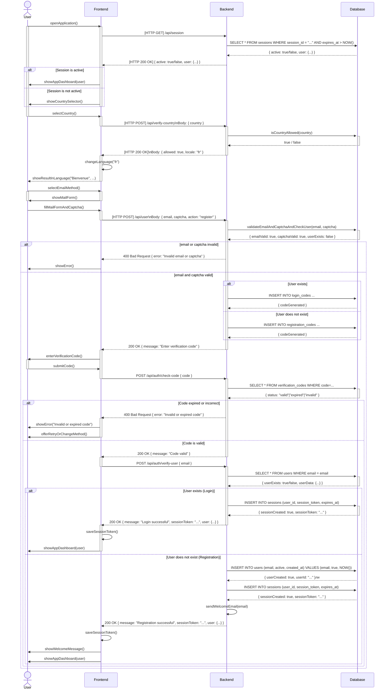

```mermaid

sequenceDiagram
  actor User
  participant Frontend
  participant Backend
  participant Database

  %% Application Launch
  User->>Frontend: openApplication()
  activate User
  activate Frontend

   %% Check session
  Frontend->>Backend: [HTTP GET] /api/session
  Backend->>Database: SELECT * FROM sessions WHERE session_id = "..." AND expires_at > NOW()
  activate Database
  Database-->>Backend: { active: true/false, user: {...} }
  Backend-->>Frontend: [HTTP 200 OK] { active: true/false, user: {...} }

  alt Session is active
    Frontend->>User: showAppDashboard(user)
  else Session is not active
    Frontend->>User: showCountrySelector()
  end

  deactivate Frontend
  %% Country Selection
  User->>Frontend: selectCountry()
  activate Frontend
  deactivate User

  %% Send API Request to Backend
  Frontend->>Backend: [HTTP POST] /api/verify-country\nBody: { country }
  deactivate Frontend
  activate Backend

  %% Query the Database
  Backend->>Database: isCountryAllowed(country)
  activate Database
  Database-->>Backend: true / false
  deactivate Database

  %% Backend Response
  Backend-->>Frontend: [HTTP 200 OK]\nBody: { allowed: true, locale: "fr" }
  deactivate Backend

  %% Frontend Handling
  activate Frontend
  Frontend->>Frontend: changeLanguage("fr")
  Frontend-->>User: showResultInLanguage("Bienvenue", ...)
  deactivate Frontend

  %% Email method selection
  User->>Frontend: selectEmailMethod()
  activate User
  activate Frontend
  Frontend->>User: showMailForm()
  deactivate User
  deactivate Frontend

  User->>Frontend: fillMailFormAndCaptcha()
  activate Frontend

  Frontend->>Backend: [HTTP POST] /api/user\nBody: { email, captcha, action: "register" }
  deactivate Frontend
  activate Backend

  Backend->>Database: validateEmailAndCaptchaAndCheckUser(email, captcha)
  activate Database
  Database-->>Backend: { emailValid: true, captchaValid: true, userExists: false }
  deactivate Database

  alt email or captcha invalid
    Backend-->>Frontend: 400 Bad Request { error: "Invalid email or captcha" }
    Frontend->>User: showError()
  else email and captcha valid
    alt User exists
      Backend->>Database: INSERT INTO login_codes ...
      Database-->>Backend: { codeGenerated }
    else User does not exist
      Backend->>Database: INSERT INTO registration_codes ...
      Database-->>Backend: { codeGenerated }
    end

    Backend-->>Frontend: 200 OK { message: "Enter verification code" }
    deactivate Backend

    activate Frontend
    Frontend->>User: enterVerificationCode()

    activate User
    User->>Frontend: submitCode()
    deactivate User

    Frontend->>Backend: POST /api/auth/check-code { code }
    activate Backend
    deactivate Frontend

    Backend->>Database: SELECT * FROM verification_codes WHERE code=...
    activate Database
    Database-->>Backend: { status: "valid"|"expired"|"invalid" }
    deactivate Database

    alt Code expired or incorrect
      Backend-->>Frontend: 400 Bad Request { error: "Invalid or expired code" }
      activate Frontend
      Frontend->>User: showError("Invalid or expired code")
      Frontend->>User: offerRetryOrChangeMethod()
      deactivate Frontend
    else Code is valid
      Backend-->>Frontend: 200 OK { message: "Code valid" }
      deactivate Backend
      activate Frontend
      Frontend->>Backend: POST /api/auth/verify-user { email }
      activate Backend
      deactivate Frontend

      Backend->>Database: SELECT * FROM users WHERE email = email
      activate Database
      Database-->>Backend: { userExists: true/false, userData: {...} }
      deactivate Database

      alt User exists (Login)
        Backend->>Database: INSERT INTO sessions (user_id, session_token, expires_at)
        activate Database
        Database-->>Backend: { sessionCreated: true, sessionToken: "..." }
        deactivate Database

        Backend-->>Frontend: 200 OK { message: "Login successful", sessionToken: "...", user: {...} }
        activate Frontend
        deactivate Backend
        Frontend->>Frontend: saveSessionToken()
        Frontend->>User: showAppDashboard(user)
        deactivate Frontend

      else User does not exist (Registration)
        Backend->>Database: INSERT INTO users (email, active, created_at) VALUES (email, true, NOW())

        Database-->>Backend: { userCreated: true, userId: "..." }ли

        Backend->>Database: INSERT INTO sessions (user_id, session_token, expires_at)
        Database-->>Backend: { sessionCreated: true, sessionToken: "..." }


        Backend->>Backend: sendWelcomeEmail(email)
        Backend-->>Frontend: 200 OK { message: "Registration successful", sessionToken: "...", user: {...} }

        Frontend->>Frontend: saveSessionToken()
        Frontend->>User: showWelcomeMessage()
        Frontend->>User: showAppDashboard(user)

      end

    end
  end

```
